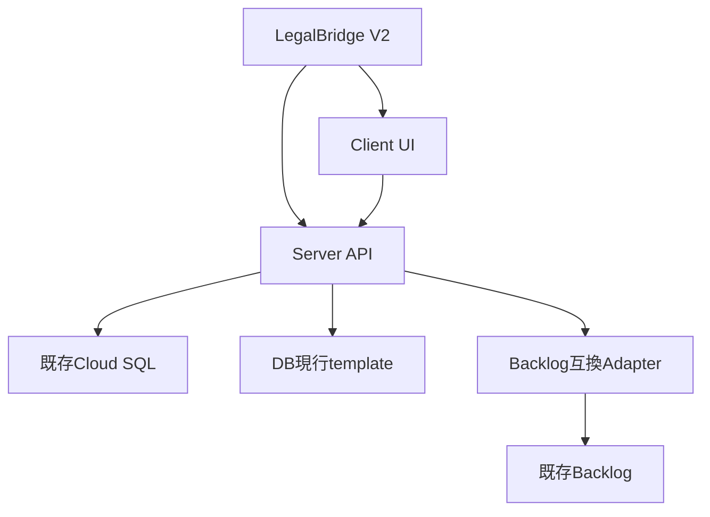

# V2 Architecture

## 方針

Admin UIとWorkerを1つのLegalBridgeアプリ、1つのデプロイ単位へ統合する。ブラウザ側は同一オリジンの`/api/v2/*`を呼び出し、サーバー側が既存DB、DB template及び外部連携を吸収する。

UIとAPIは物理的には同一アプリだが、コード上では`client`、`server`、業務モジュール、repository、integration adapterを分離する。これによりデプロイを統一しながら、巨大な単一ファイルへの再集約を防ぐ。

## 初期モジュール

- `matters`: 案件の集約表示
- `documents`: template取得、下書き、検証、プレビュー、発行
- `contracts`: 契約・条件の読取とCommand
- `masters`: 作品、取引先、担当者
- `integrations`: Backlog、Slack、Drive、CloudSign、Gmail

## 禁止事項

- UIの都合によるテーブル・列追加
- DB template本文又は`field_schema`の自動修正
- disk templateへの暗黙フォールバック
- Backlogの課題種別、ステータス、カスタムフィールド、運用変更
- UIからのマスター暗黙更新
