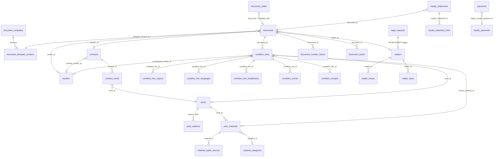

# LegalBridge DB テーブル構造分析

本番DB（Cloud SQL / PostgreSQL・DB名 `legalbridge`・スキーマ `public`）の実テーブル構造を、
リポジトリ内のSQL（`infra/gcp/sql/*.sql`）とアプリのクエリ（`apps/legalbridge/src/server/**`）から
再構成して分析したもの。

> **前提**：README の互換境界のとおり、**既存テーブル構造は変更しない**。DDLを持つのは
> V2が新規に足した `lb_v2_*` 台帳と、既存表への追加列・追加インデックスだけで、
> 既存表の本体定義はDB側にしか存在しない。したがって本書の列一覧は
> 「**アプリとマイグレーションが実際に参照している列**」の網羅であり、
> DBの完全なDDLダンプではない（未使用列がDB側に残っている可能性がある）。
>
> 調査方法：`FROM/JOIN/INSERT/UPDATE` のエイリアス解決による列参照の全走査＋
> `infra/gcp/sql` の preflight/grant/DDL の突き合わせ。

---

## 0. 総括（要点5つ）

1. **`documents` が事実上のハブかつ god table**。文書スナップショット（`form_data` JSONB）と、
   契約としての業務列（`record_type` / `contract_status` / `vendor_id` / `contract_id` …）が
   同居する。V1の `contract_capabilities` を `documents` に統合した経緯（移行0101）がそのまま残っている。
2. **金銭の物理的真実源は `condition_lines`**（条件明細）。`documents` にぶら下がり、
   国・言語は正規化テーブル（`condition_line_regions` / `condition_line_languages`）と
   レガシーのテキスト列（`region_territory` / `region_language`）の**二重持ち**。
3. **ロイヤリティ正規化（M5）系テーブルは"存在するが空だった"**ものを後から活性化した層。
   `royalty_statements` / `royalty_statement_lines` / `royalty_calculations` /
   `condition_receipts` / `manufacturing_events` / `sales_events` がこれに当たる。
4. **V2が新設したのは `lb_v2_*` の append-only 台帳のみ**。業務データではなく、
   通知・送信・再発行・無効化・エクスポート等の**監査証跡**を担う。
   UPDATE/DELETE は REVOKE され、追記専用として設計されている。
5. **DBトリガによる暗黙の副作用が残っている**（`legal_requests` INSERT → `matters` 自動生成、
   `documents` の業務列から契約行を作る V1 の `tg_doc_autolink_contract`、
   `documents_capture_number_history`）。アプリ側の書き込み設計はこの副作用を前提にしている。

---

## 1. テーブル分類と一覧

| 区分 | テーブル / ビュー | 由来 | V2の扱い |
|---|---|---|---|
| 文書生成基盤 | `document_templates`, `document_template_versions` | V1 | 読取専用（本文・`field_schema` 変更禁止） |
| | `documents` | V1 | 読み書き（中心表） |
| | `document_drafts` | V1 | 読み書き（下書き） |
| | `document_sequences` | V1 | 読み書き（採番） |
| | `document_number_history` | V2追加(026) | トリガ書込 |
| | `document_sends` | V1 | 読み書き（送信履歴） |
| マスタ | `vendors`, `staff`, `works`, `source_ips` | V1 | 読み＋限定書込 |
| | `work_relations`, `work_materials`, `material_categories`, `material_rights_sources`, `work_material_uses` | V1 | 読み書き |
| | `app_settings`, `text_snippets`, `department_workflow_rules` | V1 | 読み書き（存在しない環境では空縮退） |
| 契約・条件 | `contracts`, `contract_works` | V1 | 読み書き |
| | `condition_lines` ＋ `condition_line_regions` / `condition_line_languages` / `condition_line_installments` / `condition_events` / `condition_receipts` | V1 | **金銭の真実源** |
| | `condition_line_status_v`（ビュー） | V1 | 読取 |
| 金銭・ロイヤリティ | `royalty_statements`, `royalty_statement_lines`, `royalty_calculations` | V1（空→M5で活性化） | 読み書き |
| | `payments`, `royalty_payments`(legacy) | V1 | 読み書き／レガシー保持 |
| | `manufacturing_events`, `sales_events`, `delivery_events` | V1 | 事実イベント |
| 案件・依頼 | `matters`, `matter_issues`, `matter_tasks`, `matter_overview_v`（ビュー） | V1 | 読み書き |
| | `legal_requests`, `issue_workflows` | V1 | 書込（Slack受付） |
| | `data_quality_issues` | V1 | 読み書き |
| V2固有台帳 | `lb_v2_*`（12表） | **V2新設** | append-only |

`lb_m5_royalty_source` は永続テーブルではなく、M5バックフィル（019）内の
`CREATE TEMP TABLE ... ON COMMIT DROP`。`documents.form_data` から43項目を抽出する中間表。

---

## 2. 主要テーブル詳細

### 2.1 `documents` — 文書スナップショット兼契約レコード

参照が確認できた列（36）：

| 種別 | 列 |
|---|---|
| 識別・採番 | `id`, `document_number`, `template_type`, `template_version_id`, `record_type`, `document_category` |
| 紐づけ | `matter_id`, `issue_key`, `backlog_issue_key`, `vendor_id`, `contract_id`, `ledger_ref_id`, `material_ref_id` |
| 本体 | `form_data` (JSONB), `drive_link`, `document_url` |
| 契約業務列 | `contract_title`, `contract_status`, `contract_category`, `contract_type`, `flow_direction`, `effective_date`, `expiration_date`, `auto_renewal`, `renewal_notice_months`, `alert_lead_months`, `due_date`, `scope`, `source_system` |
| 表示・金額 | `work_name`, `original_work`, `product_name`, `vendor_name_snapshot`, `amount_ex_tax`, `amount_inc_tax` |
| 状態・監査 | `lifecycle_status`, `is_active`, `is_primary`, `created_at`, `created_by` |

構造上の要点：

- **`form_data` が業務データの一次ソース**として長く使われてきた。M5以降は
  「文書スナップショットは不変のまま残し、業務値は正規化表へ**同時書込**」という二重書込方式。
  確定処理（`documents/finalization-repository.ts`）は1トランザクションで
  `documents` INSERT →（royalty_statement のとき）正規化表へ persist → `document_drafts` DELETE を行う。
- **`lifecycle_status` は NULL 可**。レガシー行は NULL のまま存在するため、
  無効判定は必ず `lifecycle_status IS NULL OR <> 'voided'` の形で書かれている。
  値は `final` / `voided` / `reissued`。
- **`record_type` は `template_type` から導出**（`documents/document-business-columns.ts`）。
  `master_contract` / `license_condition` / `publication_condition` / `individual_contract` の4値。
  これが空だと V1 側の契約状態機械が発火せず、`tg_doc_autolink_contract` が空の `contracts` 行を作る。
- `vendor_id` は `form_data` の相手先名（`VENDOR_NAME` / `Licensor_*` / `許諾者` など優先順つき）を
  `vendors.vendor_name → trade_name → pen_name` の順で解決した結果。**解決失敗時は NULL**。
- トリガ `documents_capture_number_history` が `document_number` の変更を
  `document_number_history` に自動記録する。

### 2.2 `condition_lines` — 条件明細（金銭の真実源）

参照列（44）：

| 種別 | 列 |
|---|---|
| キー・紐づけ | `id`, `document_id`, `line_no`, `line_code`, `work_id`, `source_work_id`, `source_material_id`, `material_rights_source_id`, `counterparty_vendor_id`, `parent_license_condition_id`, `capability_id`(legacy), `product_id`, `group_no` |
| 向き | `direction`（`payable`/`receivable`）, `flow_direction`（`in`/`out`）, `is_inbound`, `transaction_kind`, `legacy_role` |
| 内容 | `condition_name`, `subject`, `region_territory`, `region_language`, `exclusivity`, `sublicense_allowed`, `term_start`, `term_end`, `delivery_date` |
| 金額 | `currency`, `rate_pct`, `unit_amount`, `amount_ex_tax`, `mg_amount`, `ag_amount`, `payment_scheme`, `payment_terms`, `payment_date`, `cycle`, `royalty_base`, `deductible_costs`, `calc_type`, `calc_method`, `formula_text` |
| 貿易・条件 | `incoterms`, `minimum_quantity`, `sell_off_months`, `withholding_tax_treatment` |
| 追加(075) | `line_kind`（`payment`/`expense`/`fee`・NOT NULL DEFAULT `payment`）, `tax_category`（`taxable`/`reduced`/`exempt`/NULL） |
| その他 | `notes`, `updated_at` |

構造上の要点：

- **`direction` と `flow_direction` と `is_inbound` の3つが向きを表す**（冗長）。
  074 のバックフィルで `flow_direction` NULL 行を `direction` から補正した経緯があり、
  歴史的にどれか一つしか書かれていない行が存在しうる。
- **地域・言語が二系統**。正規化行（`condition_line_regions` / `condition_line_languages`）が
  あればそれを `string_agg` し、無ければテキスト列にフォールバックする実装
  （`conditions/repository.ts` の `COALESCE(サブクエリ, cl.region_territory)`）。
- **`capability_id` はV1の `contract_capabilities` 時代の遺産**。
  現在は `documents.id` を指す実質的な参照として日次チェックで使われている。
- 消化実績は `condition_line_installments`（予定）と `condition_events`（実績・`voided_at` で無効化）で表現。
  この2表は `legalbridge_v2_runtime` に対して**当初SELECTのみ**だったため、
  アプリは権限エラー（`42501`）を握って `null` に縮退する実装になっている。

関連子表：

| テーブル | 列 | 用途 |
|---|---|---|
| `condition_line_regions` | `id`, `condition_line_id`, `country_name`, `country_code`, `sort_order` | 許諾地域の正規化 |
| `condition_line_languages` | `id`, `condition_line_id`, `language_name`, `language_code`, `sort_order` | 許諾言語の正規化 |
| `condition_line_installments` | `id`, `condition_line_id`, `installment_no`, `trigger_kind`, `planned_amount_ex_tax`, `due_date` | 支払予定 |
| `condition_events` | `id`, `condition_line_id`, `event_no`, `event_type`, `occurred_at`, `amount_ex_tax`, `period`, `document_id`, `installment_id`, `source_royalty_calculation_id`, `voided_at` | 消化実績 |
| `condition_receipts` | `id`, `condition_line_id`, `period`, `period_date`, `reported_sales`, `computed_royalty_ex_tax`, `computed_distribution_ex_tax`, `received_amount`, `distribution_payment_id` | サブライセンス入金 |

### 2.3 `contracts` / `contract_works` — 契約ヘッダ

`contracts`：`id`, `document_number`, `contract_level`, `record_type`, `contract_category`,
`contract_type`, `contract_title`, `primary_vendor_id`, `origin`, `lifecycle_stage`,
`contract_status`, `executed_at`, `effective_date`, `expiration_date`, `auto_renewal`,
`renewal_notice_months`, `source_system`, `document_url`, `scope`, `updated_at`

`contract_works`：`id`, `contract_id`, `work_id`, `role`（`licensed_source` / `licensed_work`）,
`rights_holder_vendor_id`

- 契約取込（`contracts/intake-repository.ts`）は
  **`contracts` → `contract_works` → `documents` → `condition_lines`** の順に1トランザクションで作る。
- `contracts` と `documents` は**契約情報が重複して載る**（`contract_title` / `contract_status` /
  `effective_date` / `expiration_date` / `auto_renewal` / `renewal_notice_months` が両方にある）。

### 2.4 作品・素材・権利

```
works ──< work_relations >── works        (親子・派生)
  │
  ├──< work_materials >──< material_rights_sources
  │         │                    └── contracts / documents / works / vendors
  │         └── material_categories
  └──< condition_lines (work_id / source_work_id / source_material_id)
```

| テーブル | 列 |
|---|---|
| `works` | `id`, `title`, `title_kana`, `work_code`, `ledger_code`, `kind`, `work_type`, `status`, `business_line`, `derivation_type`, `is_original`, `parent_work_id`, `rights_holder_vendor_id`, `default_rights_holder`, `creator_name`, `publisher_name`, `remarks`, `is_active`, `updated_at` |
| `work_relations` | `parent_work_id`, `child_work_id`, `relation_type` |
| `work_materials` | `id`, `work_id`, `material_no`, `material_code`, `material_name`, `material_type`, `material_role`, `category_id`, `rights_type`, `acquisition_type`, `rights_holder_vendor_id`, `rights_holder_label`, `territory`, `language`, `is_royalty_bearing`, `is_default`, `remarks` |
| `material_rights_sources` | `id`, `material_id`, `source_type`, `source_role`, `source_document_id`, `source_contract_id`, `source_work_id`, `rights_holder_vendor_id`, `is_primary`, `valid_from`, `valid_to` |
| `material_categories` | `id`, `name`, `rights_holder_vendor_id` |
| `work_material_uses` | `condition_line_id` ほか（条件明細と素材の使用関係） |
| `source_ips` | `source_code`, `title`, `is_active`（原作IP。作品検索・件数集計で `works` と UNION される） |

- **`works.business_line` / `ledger_code` / `remarks` は V2 が追加した列**（`ADD COLUMN IF NOT EXISTS`）。
- `works.id` の採番は V1移行が明示IDでINSERTしたためシーケンスがずれており、
  アプリ側に `setval(pg_get_serial_sequence(...))` で1回だけ自己修復するリトライが入っている
  （`works/write-repository.ts`）。**同種のズレは他表にも潜在する**。

### 2.5 案件・依頼

| テーブル | 列 |
|---|---|
| `matters` | `id`, `matter_code`, `title`, `status`, `matter_kind`(080で追加・NOT NULL DEFAULT), `lifecycle_stage`, `owner_staff_id`, `counterparty`, `vendor_id`, `primary_issue_key`, `target_due_date`, `blocked_reason`, `completion_reason`, `remarks`, `drive_folder_id`, `drive_folder_url`, `created_by`, `created_at`, `updated_at`, `completed_at` |
| `matter_issues` | `id`, `matter_id`, `backlog_issue_key`, `relation`, `summary_snapshot`, `note` |
| `matter_tasks` | `id`, `matter_id`, `title`, `task_type`, `description`, `assignee_staff_id`, `due_at`, `status`, `blocked_reason`, `is_primary` |
| `legal_requests` | `id`, `backlog_issue_key`, `slack_user_id`, `contract_type`, `counterparty`, `summary`, `notes`, `deadline`, `created_at` |
| `issue_workflows` | `backlog_issue_key`(一意), `issue_type_name`, `current_status_name`, `updated_at` |
| `department_workflow_rules` | `department`(一意), `approver_slack_id`, `stamp_operator_slack_id`, `manager_slack_id`, `slack_channel_id`, `is_active` |
| `data_quality_issues` | `entity_type`, `entity_id`, `rule_code`, `status` |

- **`legal_requests` への INSERT が AFTER INSERT トリガで `matters` を自動生成する**。
  Slack受付処理は、その直後に `matters.matter_kind` を UPDATE で上書きして分類を反映している。
  つまり**案件の生成主体はアプリではなくDBトリガ**。
- `matter_overview_v` は案件一覧の読取用ビュー（023/080 で再定義）。
  依頼者メール等をビュー側で解決するため、アプリは `SELECT *` で列名を固定しない。
- 期限（デッドライン）は永続テーブルを持たず、`legal_requests` / `documents` /
  `condition_lines` / `delivery_events` を UNION する CTE `deadline_events` として**都度導出**される。

### 2.6 金銭・ロイヤリティ（M5正規化層）

| テーブル | 位置づけ | 主な列 |
|---|---|---|
| `royalty_statements` | 計算書ヘッダ | `id`, `document_id`, `source_condition_line_id`, `actual_royalty_ex_tax` ほか（本番39列） |
| `royalty_statement_lines` | 計算書明細 | `royalty_statement_id`, `document_id`, `document_number`, `backlog_issue_key`, `line_no`, `group_no`, `contract_id`, `contract_title`, `contract_number`, `calc_method`, `product_name`, `intake_currency`, `fx_rate`, `sales_input`, `unit_price`, `quantity`, `sample_quantity`, `sales_jpy`, `rate_pct`, `payment_jpy`, `basis_note`, `source_condition_line_id`, `source_out_condition_line_id`, `gross_event_amount`, `deductions`, `source_json` |
| `royalty_calculations` | 計算結果 | `id`, `document_id`, `manufacturing_event_id`, `condition_event_id` ほか |
| `payments` | 支払/入金 | `id`, `direction`, `payment_kind`, `counterparty_vendor_id`, `work_id`, `contract_id`, `backlog_issue_key`, `source_document_number`, `period`, `currency`, `amount_ex_tax`, `tax_rate`, `total_amount`, `due_date`, `paid_date`, `status`, `legacy_royalty_payment_id` |
| `royalty_payments` | **レガシー26行** | `id`, `payment_id`, `backlog_issue_key`, `license_contract_id`, `payment_due_date`, `total_amount`, `status` |
| `manufacturing_events` / `sales_events` | 製造・売上事実 | `id`, `source_document_id` ほか |
| `delivery_events` | 納品・検収 | `id`, `backlog_issue_key`, `status`, `delivered_amount`, `inspection_deadline` |

- **計算書は支払の証明ではない**という設計方針が明文化されており、
  計算書確定から `payments` 行を作らない。
- `royalty_payments` は `payments.legacy_royalty_payment_id` で片方向にリンクされ、
  対応づかない行は `data_quality_issues` に `ROYALTY_PAYMENT_LINK_UNRESOLVED` として記録される。
- 源泉税額はどの表にも永続化されない（Excel出力時の導出値）。物理列 `payments.withholding_tax` は
  存在するとされる（出典：`docs/phase1-money-inventory.md`・V1棚卸し。V2のコードからは未参照）。
  同様に `documents.excel_issued_at`（Excel発行フラグ）も V1 側の実装が使う列で、V2 のコードには現れない。

### 2.7 V2 新設テーブル（`lb_v2_*`・append-only）

| テーブル | 目的 | 主な列 | 一意制約 |
|---|---|---|---|
| `lb_v2_slack_notification_history` | Slack通知履歴 | `matter_id`, `issue_key`, `fingerprint`, `trigger_detail` … | 配信重複防止 |
| `lb_v2_slack_notification_approvals` | 通知承認/取消 | `matter_id`, `issue_key`, `fingerprint`(CHAR(64)), `decision`(`approved`/`revoked`), `recorded_at`, `recorded_by` | — |
| `lb_v2_matter_slack_threads` | 案件⇔スレッド | `matter_id`, `channel_id`, `thread_ts`, `root_text`, `created_by` | `matter_id` UNIQUE |
| `lb_v2_slack_intake_ledger` | Slack受付証跡 | `slack_user_id`, `request_type`, `summary`, `backlog_issue_key`, `mode`, `payload`(JSONB) | — |
| `lb_v2_cloudsign_requests` | CloudSign送信 | `idempotency_key`, `document_id`, `cloud_sign_document_id`, `status`, `participant_count` | `idempotency_key` |
| `lb_v2_gmail_send_history` | Gmail送信 | `idempotency_key`, `document_id`, `recipient`, `gmail_message_id`, `gmail_thread_id` | `idempotency_key` |
| `lb_v2_inbound_contracts` | 受信契約書取込 | `idempotency_key`, `message_id`, `attachment_id`, `thread_id`, `filename`, `from_address`, `subject`, `drive_link`, `status`(`captured`/`linked`/`dismissed`) | `idempotency_key` |
| `lb_v2_document_reissue_ledger` | 再発行監査 | `source_id`, `source_number`, `new_id`, `new_number`, `base_number`, `canceled_events`, `reason`, `reissued_by` | — |
| `lb_v2_document_void_ledger` | 無効化監査 | `document_id`, `document_number`, `reason`, `voided_events`, `voided_by` | — |
| `lb_v2_excel_export_ledger` | Excel出力 | `document_number`, `batch_key`, `exported_by` | 出力重複防止 |
| `lb_v2_job_alert_ledger` | ジョブ通知 | `kind`, `ref_type`(`condition_line`/`document`), `ref_id`, `alert_date`, `detail`(JSONB) | 同日重複防止 |
| `lb_v2_webhook_receipts` | Webhook受信 | `source`(`cloudsign`/`backlog`), `external_id`, `detail`(JSONB) | `(source, external_id)` |

共通パターン：`BIGSERIAL PK` ＋ `*_at TIMESTAMPTZ DEFAULT now()` ＋ `*_by TEXT DEFAULT current_user`、
`REVOKE UPDATE, DELETE, TRUNCATE`、冪等キー（`idempotency_key CHAR(64)` の16進チェック制約）。
**既存業務表から物理的に独立**しており（FK制約を張っていない）、V2の切戻しを容易にしている。

---

## 3. リレーション図（主要部のみ）



---

## 4. 権限（GRANT）モデル

テーブル構造と同じくらい設計上の意味を持つのが**列レベル/表レベルの権限分割**である。

- ロール `legalbridge_v2_runtime` が触れるのは preflight（006）で列挙された**28リレーションのみ**。
  それ以外に権限が付いていたら preflight が異常として検出する。
- そのうち `document_template_versions`, `document_templates`, `vendors`, `staff`, `source_ips`,
  `condition_line_installments`, `condition_events`, `delivery_events`, `payments`,
  `matters`, `matter_issues`, `matter_tasks`, `matter_overview_v` は **SELECT 以外を持たせない**設計。
  機能開放のたびに `NNN_production_*_grants.sql` で必要最小の privilege を追加していく方式。
- `TRUNCATE` / `TRIGGER` / `REFERENCES` は常に異常扱い。
- 検証用は別ロール `legalbridge_v2_validation_writer`（独立DB）。
- **アプリは権限不足（`42501`）とテーブル未整備（`42P01`）を握って機能縮退する**実装が多い
  （`conditions/repository.ts` の消化率、`app_settings` / `text_snippets` / `department_workflow_rules` など）。
  権限の有無が実行時の機能フラグとして働いている。

---

## 5. 構造上の論点とリスク

| # | 論点 | 内容 | 影響 |
|---|---|---|---|
| 1 | `documents` の多目的化 | 文書スナップショット・契約・条件のハブ・Backlog連携キーを1表が兼ねる。列36以上、うち契約業務列は V1 `contract_capabilities` の統合遺産 | 変更影響の見積りが困難。`record_type` 等の導出漏れがトリガ経由で空 `contracts` 行を生む |
| 2 | 表現の二重化 | 地域/言語（テキスト列 vs 正規化表）、向き（`direction`/`flow_direction`/`is_inbound`）、契約情報（`documents` vs `contracts`） | 読取側が常に `COALESCE`/フォールバックを書く必要があり、集計のズレを生みやすい |
| 3 | JSONB 依存 | `documents.form_data` が長く一次ソース。M5以降も**二重書込**で並存 | 正規化表とスナップショットの不整合が起きうる。実際 074/M5 のバックフィルSQLが必要になった |
| 4 | NULL 許容の状態列 | `lifecycle_status` NULL のレガシー行が実在 | 「無効でない」判定を毎回 `IS NULL OR <> 'voided'` で書く必要がある（1箇所漏れると void 済みが混入） |
| 5 | 暗黙のトリガ | `legal_requests`→`matters`、`tg_doc_autolink_contract`、`documents_capture_number_history` | アプリのトランザクション設計がDB副作用に依存。移設・再実装時の見落としリスク |
| 6 | シーケンスずれ | V1移行が明示IDでINSERTしたため `works` 等の serial が実データより後ろ | 23505 の自己修復リトライが必要。他表でも同様の対処が要る可能性 |
| 7 | FK の広がり | 取引先は9表から参照される（`vendors/merge-repository.ts` の `VENDOR_REFERENCES`） | 名寄せは9表を1トランザクションで付け替える必要があり、1つ漏れると旧取引先が残る |
| 8 | 空だった正規化層 | `royalty_*` / `condition_receipts` / `*_events` は本番0行から活性化 | 実データによる検証量が少なく、制約・型の想定が未検証の部分が残る |
| 9 | レガシー列の残置 | `condition_lines.capability_id` / `legacy_role`、`royalty_payments` | 用途がコード側のコメントにしか残っていない |

---

## 6. 推奨（構造を変えずにできること）

既存テーブル構造の変更は互換境界で禁止されているため、**追加のみ**で対処できる打ち手を挙げる。

1. **本番DDLダンプの取り込み**。本書は使用列からの再構成であり、未使用列・制約・インデックス・
   トリガ定義がリポジトリに存在しない。`pg_dump --schema-only` の結果を `docs/` に固定資産として
   置けば、以後の分析・移行判断の一次資料になる（列の網羅性と実型が確定する）。
2. **導出済みビューの追加**で二重表現を吸収する。地域/言語のフォールバック、向きの正規化
   （`direction`/`flow_direction`/`is_inbound` → 単一値）をビュー側に閉じ込めれば、
   読取側の `COALESCE` 重複が消え、判定漏れのリスクが下がる。
3. **`lifecycle_status` の有効判定を1関数/1ビューに集約**。現在は各リポジトリに同じ述語が散在している。
4. **`VENDOR_REFERENCES` 相当のFK一覧をDBのメタ情報から検証する preflight** を用意する。
   コード側の固定リストとDBの実FKがずれたときに検出できる。
5. **シーケンス健全性チェック**（`setval` 要否）を全 serial 表に対する定期ジョブ/preflight として持つ。
6. `data_quality_issues` の `rule_code` 体系をドキュメント化し、
   M5 の未解決リンクなど構造起因の不整合を継続的に可視化する。

---

## 参考ファイル

- `infra/gcp/sql/005_production_v2_cutover_preflight.sql` — 期待リレーション・期待列の宣言
- `infra/gcp/sql/006_production_v2_runtime_privileges_preflight.sql` — runtime ロールの許容範囲
- `infra/gcp/sql/019_m5_royalty_normalization_backfill_studio.sql` — `form_data` からの正規化抽出
- `infra/gcp/sql/074_condition_lines_backfill_work_id.sql` — 条件明細の作品紐づけ補正
- `infra/gcp/sql/075_condition_lines_kind_tax.sql` — `line_kind` / `tax_category` 追加
- `infra/local-db/001_schema.sql` — ローカル開発用の最小スキーマ（本番へは適用しない）
- `apps/legalbridge/src/server/documents/document-business-columns.ts` — `record_type` 等の導出規則
- `apps/legalbridge/src/server/vendors/merge-repository.ts` — 取引先を参照する全表・全列
- `docs/phase1-money-inventory.md` / `docs/m5-royalty-data-normalization.md` — 金銭系の業務ロジック棚卸し
